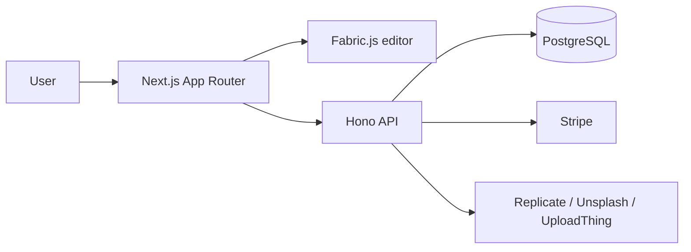

# The Canvas

The Canvas is a full-stack design editor built by [Mykhailo Yarytskiy](https://github.com/mmmihaeel). It combines authentication, template-driven workflows, project management, image uploads, prompt-based image creation, automated background cleanup, and subscription billing in a single Next.js application.

## System Overview



## Feature Summary

| Area | What it delivers |
| --- | --- |
| Authentication | Credentials, GitHub, and Google sign-in flows via NextAuth |
| Design workflow | Fabric.js-powered editor with text, shapes, drawing, filters, uploads, and export actions |
| Content bootstrap | Template catalog, curated remote images, and prompt-based image generation |
| Persistence | User-scoped project save, load, duplicate, delete, and recent activity views |
| Monetization | Stripe subscription checkout, billing portal access, and webhook-driven entitlement sync |

## Documentation Map

| Document | Purpose |
| --- | --- |
| [`docs/architecture.md`](docs/architecture.md) | System boundaries, API surface, data flow, and runtime topology |
| [`docs/data-model.md`](docs/data-model.md) | Database entities, relationships, and persistence rules |
| [`docs/operations.md`](docs/operations.md) | Environment variables, deployment checklist, and release workflow |
| [`docs/security.md`](docs/security.md) | Security architecture, trust boundaries, and hardening guidance |
| [`SECURITY.md`](SECURITY.md) | Vulnerability reporting policy |

## Stack

| Layer | Technologies |
| --- | --- |
| Frontend | Next.js 14, React, TypeScript, Tailwind CSS, Fabric.js |
| API | Hono, Zod validation |
| Auth | NextAuth, OAuth providers, bcrypt credentials |
| Data | Drizzle ORM, Neon / PostgreSQL |
| Integrations | Stripe, UploadThing, Replicate, Unsplash |

## Local Setup

1. Install dependencies:

```bash
npm install
```

2. Copy the environment template and fill in your own credentials:

```bash
cp .env.example .env.local
```

3. Start the development server:

```bash
npm run dev
```

4. Open `http://localhost:3000`.

## Environment Snapshot

| Variable | Required | Purpose |
| --- | --- | --- |
| `NEXT_PUBLIC_APP_URL` | Yes | Canonical application URL |
| `NEXT_PUBLIC_UNSPLASH_ACCESS_KEY` | Yes | Unsplash integration |
| `UPLOADTHING_SECRET` / `UPLOADTHING_APP_ID` | Yes | Upload pipeline |
| `REPLICATE_API_TOKEN` | Yes | Image generation and background removal |
| `AUTH_*` variables | Yes for enabled providers | Authentication providers and session signing |
| `STRIPE_*` variables | Yes when billing is enabled | Checkout, billing portal, and webhook validation |
| `DATABASE_URL` | Yes | Primary database connection |

Detailed environment guidance lives in [`docs/operations.md`](docs/operations.md).

## Scripts

- `npm run dev` starts the local development server.
- `npm run build` creates the production build.
- `npm run start` runs the production server.
- `npm run lint` runs ESLint.
- `npm run db:generate` generates Drizzle migrations.
- `npm run db:migrate` runs Drizzle migrations.
- `npm run db:studio` opens Drizzle Studio.

## Repository Layout

| Path | Responsibility |
| --- | --- |
| `src/app` | App Router pages, layouts, metadata, and API route mounting |
| `src/features` | Domain modules for editor, auth, projects, subscriptions, and media flows |
| `src/db` | Database schema and Drizzle wiring |
| `src/lib` | External service clients and reusable runtime bindings |
| `public` | Static assets and starter template payloads |
| `docs` | Architecture, operations, data model, and security documentation |

## Security

Security architecture and production guidance are documented in [`docs/security.md`](docs/security.md). Vulnerability reporting expectations are defined in [`SECURITY.md`](SECURITY.md).

## License

This repository is published under the [MIT License](LICENSE).
