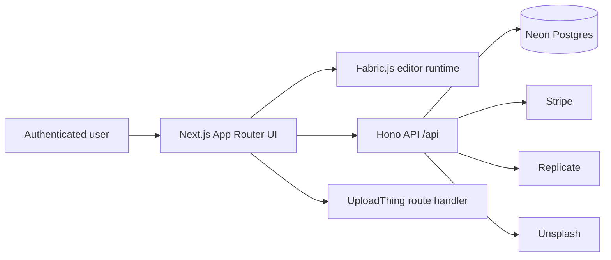
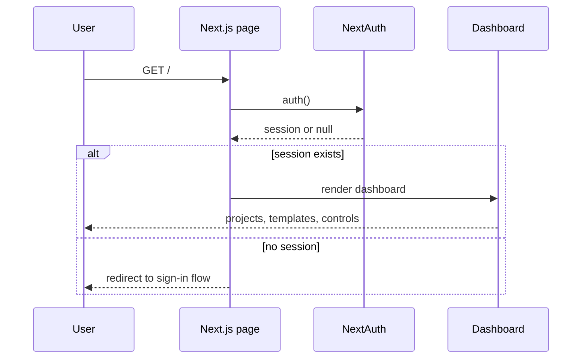
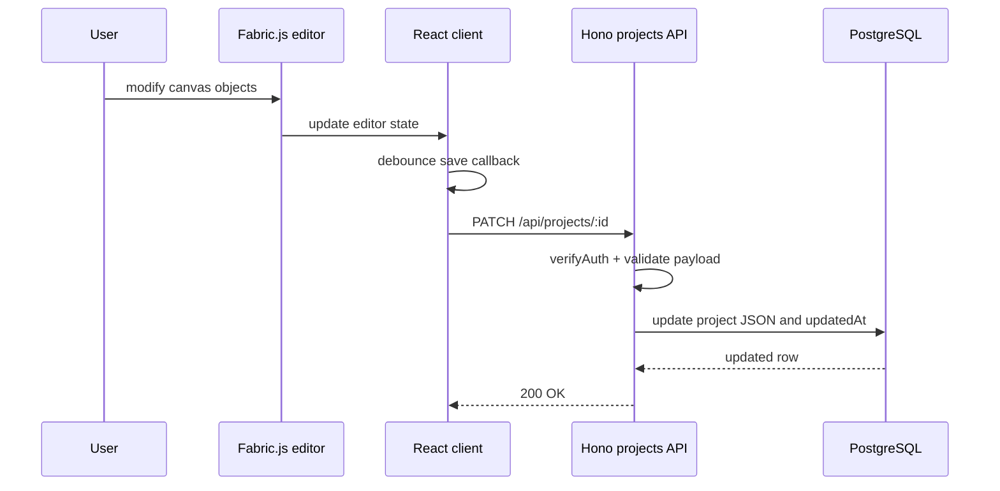
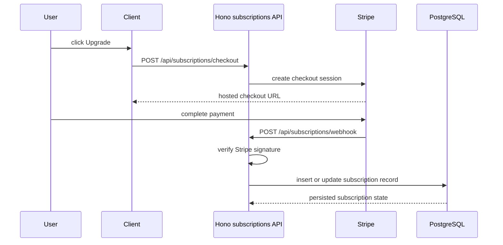

# Architecture

## Overview

The Canvas is a monolithic Next.js application with clear domain boundaries:

- App Router pages render authentication, dashboard, and editor experiences.
- A Hono API mounted under `/api` handles domain writes, reads, and integrations.
- Drizzle ORM persists identity, project, and subscription data in PostgreSQL.
- Specialized third-party services handle uploads, image generation, image sourcing, and billing.

## System Topology

## Architectural Boundaries

| Layer | Primary paths | Responsibility |
| --- | --- | --- |
| Routing and page composition | `src/app/**` | Server-rendered route groups, layouts, metadata, page access control |
| Domain UI | `src/features/**` | Editor controls, auth UX, project workflows, subscriptions, image tooling |
| API composition | `src/app/api/[[...route]]/**` | Request validation, session checks, domain orchestration, third-party calls |
| Identity | `src/auth.ts`, `src/auth.config.ts`, `src/middleware.ts` | NextAuth initialization, providers, JWT session enrichment, route middleware |
| Persistence | `src/db/**` | Schema definition and database access |
| Integrations | `src/lib/**`, `src/app/api/uploadthing/**` | Stripe, Replicate, Unsplash, UploadThing, Hono client bindings |

## Runtime Responsibilities

| Concern | Runtime owner | Notes |
| --- | --- | --- |
| Route protection | Next.js server + NextAuth middleware | Dashboard and editor access are gated through `auth()` and middleware |
| Project persistence | Hono + Drizzle | Project CRUD and template queries are scoped by authenticated user ID |
| Canvas state management | React + Fabric.js | Editor state is manipulated client-side and persisted via debounced API updates |
| File uploads | UploadThing route handler | Image-only uploads with authentication middleware and 4 MB limit |
| Billing | Stripe Checkout + webhook | Checkout creates a hosted session; webhook persists subscription state |
| Image enrichment | Replicate + Unsplash | Prompt-to-image and background removal use Replicate; gallery sourcing uses Unsplash |

## API Surface

| Route group | Representative endpoints | Auth | Responsibility |
| --- | --- | --- | --- |
| `users` | `POST /api/users` | Public | Create credential-based account |
| `projects` | `GET /api/projects`, `POST /api/projects`, `PATCH /api/projects/:id`, `DELETE /api/projects/:id`, `POST /api/projects/:id/duplicate`, `GET /api/projects/templates` | Required | Project CRUD, duplication, template catalog |
| `images` | `GET /api/images` | Required | Fetch curated remote image set from Unsplash |
| `ai` | `POST /api/ai/generate-image`, `POST /api/ai/remove-bg` | Required | Prompt-based generation and background cleanup |
| `subscriptions` | `GET /api/subscriptions/current`, `POST /api/subscriptions/checkout`, `POST /api/subscriptions/billing`, `POST /api/subscriptions/webhook` | Mixed | Subscription lookup, checkout, billing portal, Stripe webhook ingestion |
| `uploadthing` | `POST /api/uploadthing` | Required | File upload lifecycle and asset URL return |

## Core Request Flows

### Dashboard Access

### Editor Save Cycle

### Billing Upgrade Flow

## External Dependencies

| Service | Integration point | Role in system | Operational note |
| --- | --- | --- | --- |
| Neon / PostgreSQL | `src/db/drizzle.ts` | System of record for users, projects, and subscriptions | Requires stable `DATABASE_URL` |
| Stripe | `src/lib/stripe.ts`, subscriptions route | Billing, checkout, customer portal, webhooks | Requires webhook secret and hosted product price |
| UploadThing | `src/app/api/uploadthing/**` | Authenticated image upload pipeline | Enforces size/type constraints before asset ingestion |
| Replicate | `src/lib/replicate.ts`, `ai.ts` | Image generation and background removal | Server-side token only |
| Unsplash | `src/lib/unsplash.ts`, `images.ts` | Seed image discovery for editor workflows | Uses access key intended for public app integration |

## Design Notes

1. The application keeps editor manipulation client-side and persists serialized Fabric.js state rather than individual design primitives.
2. Authorization is applied at the route handler layer and reinforced by user-scoped database filters.
3. Third-party service calls are isolated behind server endpoints so operational secrets remain outside the browser.
4. The current codebase is intentionally monolithic, which simplifies deployment and local onboarding for a portfolio project.
