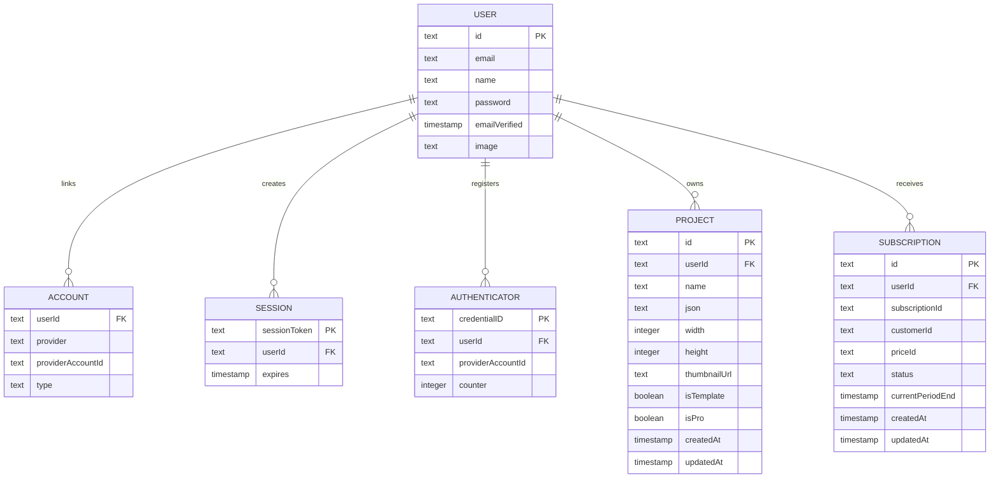

# Data Model

## Entity Relationship Diagram

## Table Inventory

| Table | Purpose | Primary key | Key foreign keys | Notes |
| --- | --- | --- | --- | --- |
| `user` | Core identity record for all application users | `id` | None | Credential users may also store a hashed password |
| `account` | OAuth provider linkage for NextAuth | Composite `(provider, providerAccountId)` | `userId -> user.id` | Supports GitHub and Google providers |
| `session` | Auth session storage | `sessionToken` | `userId -> user.id` | Present for NextAuth compatibility |
| `verificationToken` | Email or token verification primitives | Composite `(identifier, token)` | None | Reserved for NextAuth verification flows |
| `authenticator` | Passkey/WebAuthn support primitives | Composite `(userId, credentialID)` | `userId -> user.id` | Future-facing auth storage |
| `project` | Saved editor document or template | `id` | `userId -> user.id` | Stores serialized Fabric.js JSON snapshot |
| `subscription` | Billing state projection | `id` | `userId -> user.id` | Mirrors Stripe subscription state needed by paywall logic |

## Domain Semantics

### User and Identity Tables

| Field | Meaning | Operational note |
| --- | --- | --- |
| `user.email` | Primary human identifier | Application code currently checks uniqueness before insert |
| `user.password` | Bcrypt hash for credential login | Nullable for OAuth-only users |
| `account.*` | External provider mapping | Enables GitHub and Google sign-in |
| `session.expires` | Session expiry instant | Managed by NextAuth runtime |
| `authenticator.*` | WebAuthn credential metadata | Present for adapter completeness even if not surfaced in UI |

### Project Table

| Field | Meaning | Used by |
| --- | --- | --- |
| `name` | Human-readable project label | Dashboard, duplication, navigation |
| `json` | Serialized Fabric.js state | Editor load/save lifecycle |
| `width`, `height` | Workspace dimensions in pixels | Editor canvas sizing and template previews |
| `thumbnailUrl` | Optional preview image | Template/project cards |
| `isTemplate` | Catalog visibility flag | Template dashboard and template sidebar |
| `isPro` | Premium gating flag | Paywall logic for premium templates |
| `createdAt`, `updatedAt` | Timeline fields | Sorting and recent activity views |

### Subscription Table

| Field | Meaning | Used by |
| --- | --- | --- |
| `subscriptionId` | Upstream Stripe subscription ID | Webhook correlation and billing lifecycle |
| `customerId` | Stripe customer identifier | Billing portal session creation |
| `priceId` | Purchased price or product reference | Paywall entitlement evaluation |
| `status` | Stripe lifecycle state | UI messaging and access control |
| `currentPeriodEnd` | End of paid entitlement window | `checkIsActive` grace-period logic |

## Data Ownership Rules

1. Every mutable business object is scoped to `userId`.
2. Template records share the `project` table with user-generated projects and are differentiated by flags, not a separate catalog table.
3. Subscription state is stored as an application-side projection of Stripe data, not as the authoritative billing source.
4. Editor state is persisted as opaque JSON, which optimizes product velocity and restore fidelity at the cost of relational analytics.

## Persistence Invariants

| Invariant | Why it matters |
| --- | --- |
| Project reads and writes must always include both `project.id` and `project.userId` filters | Prevents cross-tenant document access |
| OAuth accounts, sessions, and authenticators cascade on user deletion | Keeps auth-related records consistent |
| Template pagination sorts free content before premium content | Supports a clear onboarding path for non-paying users |
| Subscription access is derived from both `priceId` presence and `currentPeriodEnd` freshness | Avoids granting access from stale or incomplete records |
