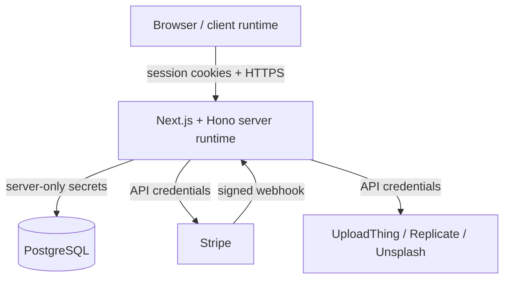

# Security

## Security Goals

The project is optimized for a public-facing SaaS-style portfolio deployment with the following priorities:

1. Keep privileged credentials on the server only.
2. Scope project and billing operations to the authenticated user.
3. Validate all external write inputs at the API boundary.
4. Verify authenticity of payment webhooks before persisting billing state.
5. Limit file ingestion to authenticated image uploads with bounded size.

## Trust Boundaries

## Security Controls in Code

| Control area | Current implementation | Code location | Security value |
| --- | --- | --- | --- |
| Route authentication | `verifyAuth()` on protected Hono routes and `auth()` checks on server pages | `src/app/api/[[...route]]/**`, `src/features/auth/utils.ts` | Prevents anonymous access to project, media, and billing flows |
| Authorization scoping | Project and subscription queries are filtered by `auth.token.id` | `projects.ts`, `subscriptions.ts` | Reduces cross-user data access risk |
| Request validation | Zod schemas via `zValidator` and credential parsing | `projects.ts`, `users.ts`, `ai.ts`, `auth.config.ts` | Rejects malformed writes at the edge of the domain |
| Password handling | Credential passwords are bcrypt-hashed and compared server-side | `users.ts`, `auth.config.ts` | Avoids plaintext password persistence |
| Secret segregation | Service tokens are read from environment variables and used server-side | `src/lib/**`, `.env.example` | Keeps operational secrets out of the client bundle |
| Upload restrictions | UploadThing route accepts images only and caps file size at 4 MB | `src/app/api/uploadthing/core.ts` | Narrows ingestion surface and abuse risk |
| Payment authenticity | Stripe webhook uses raw body + signature verification | `src/app/api/[[...route]]/subscriptions.ts` | Prevents forged billing events |
| Public/client config boundary | Only `NEXT_PUBLIC_*` values are exposed to the browser | `.env.example`, `src/lib/hono.ts` | Makes client/server configuration intent explicit |

## Sensitive Assets

| Asset | Classification | Threat if exposed | Protection strategy |
| --- | --- | --- | --- |
| `AUTH_SECRET` | Critical | Session forgery | Store in secret manager, rotate if leaked |
| OAuth client secrets | High | Unauthorized provider impersonation | Server-only environment variables |
| `DATABASE_URL` | Critical | Direct data compromise | Secret storage, network controls, rotation |
| `STRIPE_SECRET_KEY` and `STRIPE_WEBHOOK_SECRET` | Critical | Fraudulent billing actions or forged webhook events | Secret storage and webhook verification |
| `REPLICATE_API_TOKEN` | High | Unauthorized paid inference usage | Server-only environment variable |
| UploadThing secret | High | Unauthorized file pipeline access | Server-only environment variable |
| Project JSON payloads | Medium | Design data exposure | User-scoped queries and authenticated routes |

## Threat Surface Review

| Surface | Existing control | Recommended operator action |
| --- | --- | --- |
| Protected Hono endpoints | Auth middleware + user-scoped queries | Add rate limiting at the platform edge for write-heavy endpoints |
| Credential sign-up and sign-in | Validation + bcrypt | Add monitoring or throttling for brute-force resistance in production |
| Upload pipeline | Authenticated image uploads only | Scan files at the storage boundary if compliance requirements increase |
| Stripe webhook | Signature validation | Keep webhook secret isolated and monitor repeated failures |
| Public client configuration | Explicit `NEXT_PUBLIC_*` naming | Avoid placing secrets in any client-exposed variable |
| Third-party AI/media providers | Server-side token usage | Monitor quota exhaustion and unexpected spend |

## Secure Configuration Guidance

### Secrets

- Keep `.env`, `.env.local`, and environment-specific credential files out of version control.
- Rotate credentials immediately if they are shared outside approved operational channels.
- Treat public access keys and app URLs as non-secret, but still manage them deliberately.

### Network and Hosting

- Serve production traffic over HTTPS only.
- Place the app behind an edge or platform layer that can enforce rate limiting and header policy.
- Configure security headers such as CSP, `X-Content-Type-Options`, and clickjacking protection at the hosting layer.

### Database and Data Handling

- Use least-privilege database credentials.
- Back up project data on a schedule appropriate to the deployment.
- Restrict direct database access to operational personnel only.

## Production Hardening Checklist

| Item | Status expectation |
| --- | --- |
| HTTPS enforced on the public origin | Required |
| Secrets injected from deployment platform, not committed files | Required |
| OAuth redirect URIs restricted to owned domains | Required |
| Stripe webhook endpoint registered with the exact deployed URL | Required |
| Database backups and access controls configured | Required |
| Platform-level rate limiting enabled for auth and write endpoints | Recommended |
| Dependency scanning in CI or GitHub security tooling | Recommended |
| Centralized logging for auth, billing, and upload failures | Recommended |

## Security Documentation Scope

This document describes the controls visible in the repository and the operating assumptions required for a secure deployment. Infrastructure-level protections that are not represented in code, such as WAF rules, managed TLS, or CDN header policies, must be verified in the target hosting environment.
